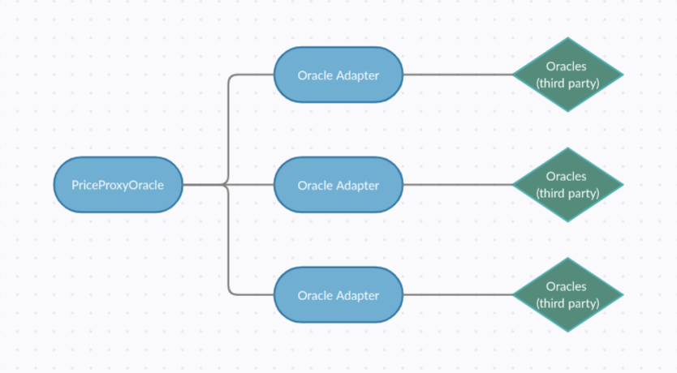

# Oracles
Given that we foresee the possibility of diverse Oracle systems being deployed in the network, we developed a middle-layer contract adapter system to interact with each Oracle as an intermediary. This way, the rLending Protocol is capable of receiving price information from every kind of Oracle, regardless of its implementation.

Oracles are very important for DEFI solutions, so we use them as a critical part of this protocol.
rLending will launch using the [Money on Chain v1 oracles](https://github.com/money-on-chain/Amphiraos-Oracle) that are currently on mainnet. The BTC price oracle is already in use by [Money on Chain protocol](https://alpha.moneyonchain.com/) and its tokens (DoC, BPro and BTCx). The RIF price oracle is already in use by [RIF on Chain protocol](https://rif.moneyonchain.com/) and its tokens (RDOC, RIFP and RIFX). Finally, for rUSDT price we are using a fixed price of 1 USD as the USDT can be exchanged by that amount and USDT in RSK is not yet listed on other exchanges besides [RSK Swap](https://rskswap.com/)
As this is a centralized oracle run by a third party rLending will be monitoring it. In case of abnormal results, it will be changed to another oracle solution or we will run our own.

# Roadmap
As RSK continues to grow so does the maturity of the oracles in it. Money on Chain will be launching in the near future their [v2 oracles called oMoC](https://developers.rsk.co/solutions/oraclemoneyonchain/). This new version will be decentralized, reduce costs and add economic incentives. rLending will update to this new version when it's available on mainnet and register its own Oracle on the oMoC protocol
[Chainlink](https://chain.link/) is also planning on launching [their oracles on RSK ](https://www.rifos.org/blog/chainlink-integrated-as-part-of-the-rif-gateways-ecosystem-on-rsk) this will be a powerful alternative as Chainlink oracles are widely used in Ethereum.
